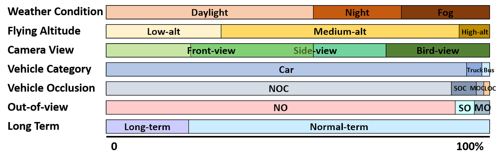
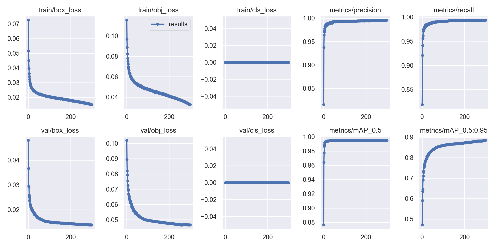

# Vehicle Density Map for Traffic Managment
Progetto che crea mappe 2D di densità che rappresentano la predisposizione dei veicoli in una determinata immagine.
- SISTEMA DI OBJECT DETECTION : YOLOv5m
- DATASET : UAVDT Dataset
- ALLENAMENTO
- RISULTATI
---
###  YOLOv5m
Per maggiori informazioni sul modello usato visualizzare questo [link](https://github.com/ultralytics/yolov5)

---
###  UAVDT-M Dataset 
Il dataset è composto da circa 40000 immagini che hanno le seguenti caratteristiche.

Per maggiori informazioni sul dataset usato aprire questo [link](https://sites.google.com/view/grli-uavdt/%E9%A6%96%E9%A1%B5)

Nella cartella `scripts` sono presenti i file che ho utilizzato per formattare il dataset nel formato YOLO:
* `organise_image_folders.py` copia le immagini in un unica cartella
* `organise_txt_labels.py` formatta le annotazioni nel formato YOLO `class  x-center  y-center  width  height` compresi in [0,1]
* `split_train_val.py` crea un training set e un validation set

Di tutte le immagini del dataset ho estratto manualmente quelle che hanno una vista bird-view o comunque un vista dall'alto,
le categorie di immagini scelte sono:
* M0203
* M0210
* M0603
* M0701
* M0702
* M0703
* M0801
* M0901
* M1008
* M1009
* M1102
* M1201

Per un totale di 10291 immagini di test e 1.544 di test.

---
###  ALLENAMENTO
Allenamento svolto su un calcolatore con:
* Processore : AMD Ryzen 5 2600 Six-Core 3,4 GHz
* GPU : NVIDIA Geoforce 1070
* RAM : 8 Gb

---
###  RISULTATI

