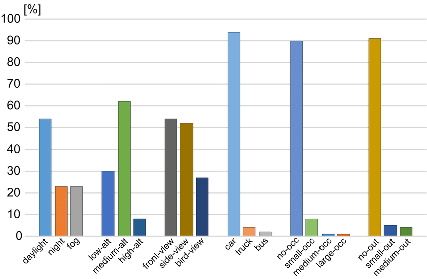
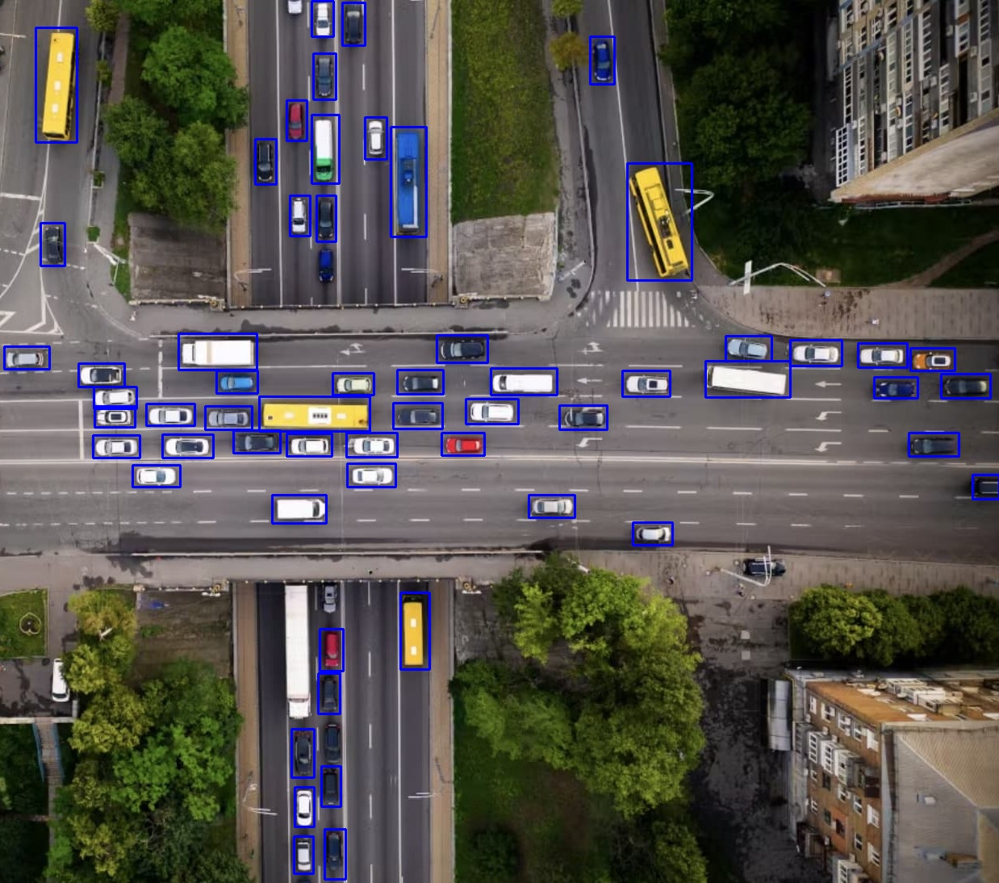
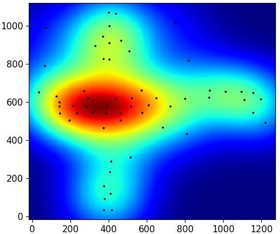

# Mappe di Densità di veicoli per la gestione del traffico
Progetto che crea mappe di densità che rappresentano la predisposizione dei veicoli in una determinata immagine.
- SISTEMA DI OBJECT DETECTION : YOLOv5
- DATASET : UAVDT Dataset
- ALLENAMENTO
- RISULTATI
---
###  YOLOv5
Per maggiori informazioni sul modello usato visualizzare questo [link](https://github.com/ultralytics/yolov5)

---
###  UAVDT-M Dataset 
Il dataset è composto da circa 40000 immagini che hanno le seguenti caratteristiche.

Per maggiori informazioni sul dataset usato aprire questo [link](https://sites.google.com/view/grli-uavdt/%E9%A6%96%E9%A1%B5)

Nella cartella `scripts` sono presenti i file che ho utilizzato per formattare il dataset nel formato YOLO:
* `organise_image_folders.py` copia le immagini in un unica cartella
* `organise_txt_labels.py` formatta le annotazioni nel formato YOLO `class  x-center  y-center  width  height` compresi in [0,1]
* `split_train_val.py` crea un training set e un validation set

Di tutte le immagini del dataset ho estratto manualmente quelle che hanno una vista bird-view o comunque un vista dall'alto,
le categorie di immagini scelte sono:
* M0203
* M0210
* M0603
* M0701
* M0702
* M0703
* M0801
* M0901
* M1008
* M1009
* M1102
* M1201

Per un totale di 10291 immagini di train e 1.544 di test.

---
###  ALLENAMENTO
Allenamento svolto su un calcolatore con:
* Processore : AMD Ryzen 5 2600 Six-Core 3,4 GHz
* GPU : NVIDIA Geoforce 1070
* RAM : 8 Gb

Allenamento svolto in 300 epoche i cui iperparametri sono consultabili nel file `hyp.yaml`

---
###  RISULTATI

La pipeline che descrive i passaggi dell' algoritmo è:

Sono presenti due file main:
* `main_opencv.py` : va eseguito se non si ha una gpu
* `main_pytorch.py` : sfrutta la potenza della propria gpu tramite CUDA e Pytorch, inoltre va clonata la repository ufficiale di [yolov5](https://github.com/ultralytics/yolov5)

La rete neurale riesce a riconoscere la maggior parte dei veicoli in un immagine, fa fatica sopratutto in casi di scarsa illuminazione, ad altezze elevate e quando i veicoli sono molto vicini tra loro, ecco alcuni esempi:

<table cellspacing="3" cellpadding="3" width="900" border="0">
<tbody>
<tr>
<td valign="center" width=300"></td>
<td valign="center" width="300"></td>
<td valign="center" width="300"></td>
</tr>
<tr>
<td valign="center" width=300"></td>
<td valign="center" width="300"></td>
<td valign="center" width="300"></td>
</tr>
</tbody>
</table>
